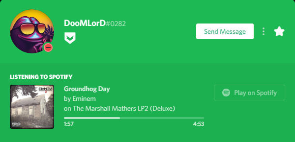

# Čo je to RPC?

#### Čo je to RPC a ako to funguje?

Bohatá Prítomnosť (Rich Presence) je jeden z najkoolovejších vlastností Discordu v tomto momente a v podstate mení pohľad a štýl vášho "teraz hrá" na vašom Discord profile. Discord podporuje RPC hry \(ako napríklad GTA V™, Rainbow Six® Siege atď.\) a vysiela váš v-hre status na vás Discord profil vo naozaj koolovom spôsobe. V podstate použijú svoju aplikáciu na posielanie vášho hravého statusu do Discordu ktorý potom vykreslí tie informácie ako bohatú prítomnosť na vašom profile. A na koniec, vzniknú v spôsobe pod obrázkom.

