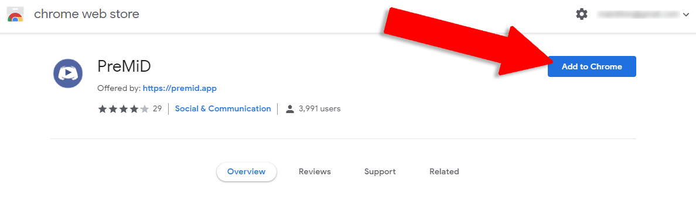

# Extensie


Trebuie să instalezi extensia și aplicația pentru a funcționa corect!


### Extensie

Instalarea extensiei este cea mai ușoară parte! Doar apasă click pe numele browser-ului tău și urmărește instrucțiunile.




Firefox a șters extensia noastră de pe magazinul add-on. Nu îți face griji, vom încerca să o reînviem din morți pentru că plănuim să o încărcăm pe serverele noastre proprii în următoarea actualizare! Pentru moment, poți aștepta sau urmărește instrucțiunile de mai jos.


1. Du-te la [lansări](https://github.com/PreMiD/PreMiD/releases)
2. Descarcă [premid-1.3.1.2-fx.xpi](https://github.com/PreMiD/PreMiD/releases)
3. Du-te la`about:addons` 
4. Apasă click pe simbolul mic pentru roată din dreapta sus.
5. Alege **"Install add-on from file"**.
6. Selectează fișierul pe care l-ai descărcat recent.
7. Acceptă instalarea apăsând pe "**Add**".
8. Instalează [aplicația](application.md) dacă nu ai făcut asta deja.



1. Du-te la [pagina de magazin](https://chrome.google.com/webstore/detail/premid/agjnjboanicjcpenljmaaigopkgdnihi?authuser=0&hl=en).
2. Click pe **"Add to Chrome"**.
3. Instalează [aplicația](application.md) dacă nu ai făcut asta deja.




1. Instalează extensia numită **"**[**Install Chrome Extensions**](https://addons.opera.com/en/extensions/details/install-chrome-extensions/)**"**.
2. Acum instalează [extensia PreMiD](https://chrome.google.com/webstore/detail/premid/agjnjboanicjcpenljmaaigopkgdnihi).
3. Instalează [aplicația](application.md) dacă nu ai făcut asta deja.



