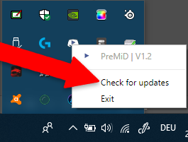
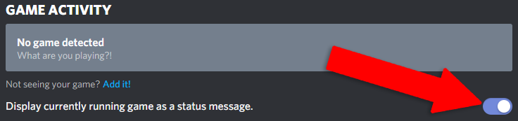
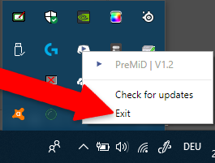

# Rozwiązywanie problemów

## Najpierw...

Upewnij się, że zainstalowałeś [aplikację](../installation/application.md) **oraz** [rozszerzenie](../installation/extension.md).  
Jeśli to nie zadziałało, podążaj za krokami poniżej. Nie musisz robić ich po kolei.

## Discord nie pokazuje statusu

### Upewnij się, że Discord nie jest uruchomiony w trybie administratora

Bardzo ważne. RPC nie działa w trybie administratora.

### Sprawdź czy masz włączonego antywirusa lub firewalla na swoim komputerze

Czasami **antywirusy** i **firewalle** **blokują aplikację** które tworzą/hostują serwery lub tylko łączą się z internetem. Używamy **lokalnego serwera** do **przesyłania danych** pomiędzy aplikacją a rozszerzeniem, więc jeśli zablokujesz możliwość aplikacji do przesyłania danych, **nie będziesz mógł używać PreMiD**.

Możesz sprawdzić więcej informacji o firewallach i wyłaczaniu ich aby **naprawić** twój problem na **Google**.

### Upewnij się, że masz zainstalowaną ostatnią wersję PreMiD

Możesz to sprawdzić klikając w **'Check for updates'** na pasku zadań w ikonce PreMiD.  
Aplikacja powinna też dać ci znać o aktualizacji przez powiadomienia.  
Rozszerzenie aktualizuje się samo.


Wersje deweloperskie i instalowane samemu nie aktualizują się.


### Pamiętaj, żeby włączyć RPC w ustawieniach Discorda

### Odśwież stronę

Możesz wciśnąć **Shift/F5** or **CMD+R** na twojej klawiaturze zamiast szukać przycisku odświeżenia.

### Zrestartuj przeglądarkę

**Alt+F4** też działa dobrze. Pamiętaj, żeby po tym uruchomić przeglądarkę.

### Powyłączaj inne rozszerzenia

Wyłącz wszystkie rozszerzenia i zobacz czy PreMiD znów działa.  
Jeśli tak, włączaj wszystkie rozszerzenia po kolei i powiedz nam, które rozszerzenie psuje PreMiD.

### Zrestartuj aplikacje

Po tym uruchom aplikację z powrotem.

### Odśwież/Zrestartuj Discorda

Wciśnij **Ctrl+R** or **CMD+R** na twojej klawiaturze aby odświeżyć Discord lub wyłącz i włącz aplikację.

### Zrestartuj swój komputer

Mam nadzieję, że wiesz jak zrestartować komputer.

### Zainstaluj PreMiD ponownie

Czasem podczas instalacji pliki mogą się zepsuć. Aby zainstalować PreMiD ponownie, podążaj za krokami [tutaj](../installation/application.md).

### Manualne usunięcie



1. 1. Idź do `C:\Users\USER\AppData\Local` i usuń folder `premid`
2. 1. Idź do `C:\Users\USER\AppData\Roaming` i usuń folder`PreMiD`



Idź do `YOURDISK:/users/USER/~Library/Application Support` i usuń folder`PreMiD`



Jeśli nic z tych rzeczy nie pomogło, oznacz developera na [naszym serwerze](https://discordapp.com/invite/WvfVZ8T) Discord.

## To nie rozwiązało mojego problemu.

Możesz:

* [Otworzyć issue](https://github.com/PreMiD/PreMiD/issues/new/choose) na [GitHub](https://github.com/PreMiD/PreMiD)
* Zapytaj developera na [\#support](https://discord.gg/WvfVZ8T)

  

